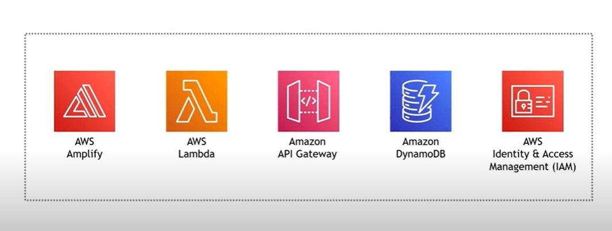

This project utilizes multiple AWS Resources including
AWS Amplify, AWS Lambda, Amazon API Gateway, Amazon DynamoDB,
and AWS Identiy & Access Management (IAM)

The web application is deployed using Amplify. The user can enter a base number and an exponent. These values are given to the Lambda function with does the calculation and then utilizes Amazon API Gateway to store the result in DynamoDB.